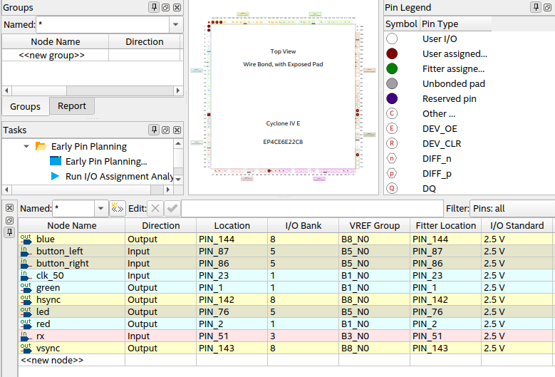
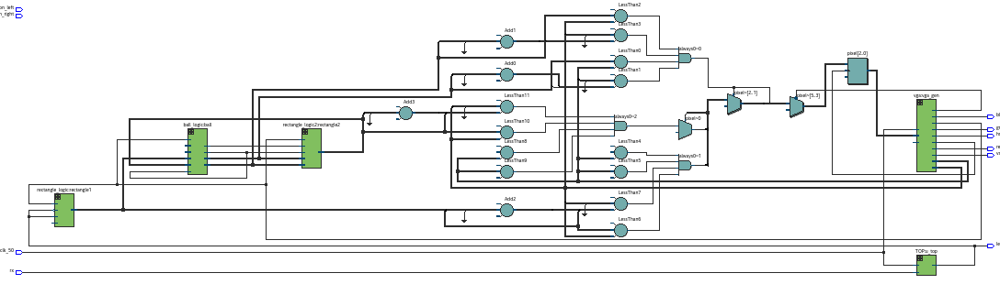

# proyecto: Juego Arcade ( Pong )

* Jesus Antonio Lopez Trigozo

# Proyecto Final: Implementación de Juego con Control Bluetooth en FPGA

## video demostrativo

[](https://www.youtube.com/watch?v=0h3I9Lt0ql8)

## Descripción del Proyecto

Este proyecto tiene como objetivo el desarrollo de un juego en FPGA, específicamente un juego tipo **Pong**, en el cual el control del juego se realizará a través de una **aplicación móvil** conectada al sistema mediante un módulo **Bluetooth HC-05**. El juego se implementará en una FPGA y se mostrará en una pantalla a través de una salida **VGA**. El objetivo de este diseño es proporcionar una experiencia de juego interactiva sin necesidad de cables adicionales o periféricos complicados, utilizando únicamente la FPGA, el módulo Bluetooth y el teléfono móvil como control.

## Especificación Detallada del Sistema

### Componentes Principales

1. **FPGA (Plataforma de Implementación)**
   - **Funcionalidad**: La FPGA será la encargada de procesar el juego y la interfaz gráfica. Implementará la lógica del juego (movimiento de objetos, colisiones, puntajes) y la salida de video VGA. 
   - **Entradas**: Señales de control recibidas desde el teléfono móvil (a través del módulo Bluetooth).
   - **Salidas**: Señal de video VGA para la visualización en pantalla.

2. **Módulo Bluetooth HC-05**
   - **Funcionalidad**: El módulo Bluetooth permitirá la comunicación inalámbrica entre la FPGA y el teléfono móvil, que servirá como control del juego.
   - **Conexión**: El HC-05 se conectará a la FPGA mediante la interfaz UART, permitiendo recibir comandos desde la aplicación móvil (como mover los controles del juego).

3. **Teléfono Móvil**
   - **Funcionalidad**: El teléfono móvil será utilizado para controlar el juego. A través de una aplicación personalizada, el usuario podrá enviar comandos de control (por ejemplo, mover el paddle en el juego) al módulo Bluetooth HC-05, que a su vez los enviará a la FPGA.
   - **Conexión**: La conexión Bluetooth se gestionará mediante una aplicación desarrollada por el usuario, la cual se encargará de enviar los datos de control a la FPGA.

4. **Pantalla VGA**
   - **Funcionalidad**: La pantalla VGA se utilizará para mostrar la salida gráfica del juego, que incluye los objetos (paddle, bola).
   - **Conexión**: La FPGA generará las señales necesarias para la salida VGA, con la correcta sincronización de las señales HSync y VSync para visualizar el juego en la pantalla.

### Funcionalidad del Juego

El juego será un clásico tipo **Pong** en el que el jugador controlará un paddle en la parte lateral de la pantalla, moviéndolo hacia arriba o abajp para evitar que la pelota se salga o se destruya. El juego deberá tener características como:

- Movimiento de los objetos en la pantalla (bola, paddle).
- Detención de la pelota al llegar a los límites o interacción con los objetos.
- Puntaje en la pantalla.
- Interactividad mediante el control del teléfono móvil.

## Plan Inicial de la Arquitectura del Sistema

```plaintext
       ┌──────────────────────────────┐
       │          vga_demo            │───────────┐
       │           (Main)             │           │
       ▲───────────▲──────────────────┤           │
       │           │                  │           │ 
       ▼           ▼                  ▼           │
┌──────────┐  ┌─────────────┐   ┌─────────────┐   │
│   TOP    │  │ ball_logic  │   │    VGA      │   │
│ (Serial) │  │ (Lógica)    │◄─►│ (Video Out) │   │
└──────────┘  └────▲──────▲─┘   └─────────────┘   │
        ▲          │      │───────────────┐       │
        │          │                      │       │
        ▼          ▼                      ▼       ▼
┌──────────┐    ┌──────────────┐    ┌─────────────────────┐
│ Bluetooth│    │ rectangle_1  │    │ rectangle_2         │
│(uart_rx) │---▶│ (Jugador 1)  │    │ (Jugador 2 autónomo)│
└──────────┘    └──────────────┘    └─────────────────────┘
  
```

### a) **Especificación de los Componentes del Proyecto**

1. **FPGA (Plataforma de Implementación)**
   - Descripción Funcional: La FPGA implementará toda la lógica del juego, incluida la creación de la interfaz de usuario (gráficos en la pantalla VGA) y la gestión de las entradas del control (a través de Bluetooth).


2. **Módulo Bluetooth HC-05**
   - Descripción Funcional: El HC-05 se encarga de la transmisión y recepción de datos entre el teléfono móvil y la FPGA. El teléfono enviará comandos que serán interpretados por la FPGA para mover el paddle y ajustar otros aspectos del juego.

3. **Teléfono Móvil**
   - Descripción Funcional: El teléfono móvil envía comandos de control para mover el paddle y posiblemente otras configuraciones del juego . La app será responsable de transmitir estos comandos por Bluetooth.

4. **Pantalla VGA**
   - Descripción Funcional: La pantalla VGA visualizará el estado del juego, incluidos los objetos del juego y el puntaje.

### b) **Lenguaje Adecuado y Descripción del Sistema**

Para este proyecto, la FPGA se programará utilizando un lenguaje de descripción de hardware (HDL), como  **Verilog**, para implementar la lógica del juego, la generación de las señales VGA y la comunicación con el módulo Bluetooth HC-05.


# Código implementado 

### vga_demo
- este es el Código principal , el cual llama a todos los demas, y hace que funcionen en conjungo

```verilog
module vga_demo(
    input clk_50,                    // 50 MHz / 20 ns
    input button_left,               // Entrada de botón para mover a la izquierda
    input button_right,              // Entrada de botón para mover a la derecha
    input rx,                        // Entrada de datos UART (RX) para controlar el LED
    output red, green, blue,         // VGA color outputs
    output hsync, vsync,             // VGA sync outputs
    output led                       // Salida para el LED
);

    wire [9:0] hpos, vpos;           // Posición actual del píxel
    wire active;                     // Bandera de área activa
    wire pixel_tick;                 // Pulso generado cuando la posición del píxel es estable (25 MHz)
    wire frame_tick;                 // Pulso generado cuando entra en el área de blanking (60 Hz)

    reg [2:0] pixel;                 // Color RGB del píxel actual

    // Parámetros del rectángulo
    localparam RECTANGLE_WIDTH = 10;   // Ancho original del rectángulo
    localparam RECTANGLE_HEIGHT = 100; // Alto original del rectángulo
    localparam SCREEN_WIDTH = 640;     // Ancho de la pantalla VGA
    localparam SCREEN_HEIGHT = 480;    // Alto de la pantalla VGA

    // VGA generator (modulo vga)
    vga vga_gen(
        .clk(clk_50),
        .reset(1'b0),                 // No hay reset en este módulo
        .pixel_rgb(pixel),
        .hsync(hsync),
        .vsync(vsync),
        .red(red),
        .green(green),
        .blue(blue),
        .active(active),
        .ptick(pixel_tick),
        .xpos(hpos),
        .ypos(vpos),
        .ftick(frame_tick)
    );

    // Lógica de la pelota (ahora de 4x4 píxeles)
    wire [9:0] square_hpos;
    wire [9:0] square_vpos;
    wire move_up, move_right;
    wire reset_game;  // Señal de reset para todo el juego
    ball_logic ball(
         .clk(frame_tick),
         .reset(reset_game),  // Usar reset de la pelota y raquetas
         .rectangle1_vpos(rectangle1_vpos), // Posición de la raqueta izquierda
         .rectangle2_vpos(rectangle2_vpos), // Posición de la raqueta derecha
         .rectangle_width(RECTANGLE_WIDTH), // Ancho de las raquetas
         .rectangle_height(RECTANGLE_HEIGHT), // Alto de las raquetas
         .square_hpos(square_hpos),
         .square_vpos(square_vpos),
         .move_up(move_up),
         .move_right(move_right),
         .reset_game(reset_game)  // Pasar la señal de reset
    );


    // Lógica del primer rectángulo que se mueve (a la izquierda)
    wire [9:0] rectangle1_vpos; // Posición vertical del primer rectángulo
    rectangle_logic rectangle1(
        .clk(frame_tick),
        .reset(1'b0),  // No se necesita reset
        .move_left(!led_from_top),  // Mover hacia arriba cuando el LED está apagado
        .move_right(led_from_top), // Mover hacia abajo cuando el LED está encendido
        .rectangle_vpos(rectangle1_vpos)
    );

    // Lógica del segundo rectángulo que se mueve (a la derecha) con el nuevo módulo rectangle_logic2
    wire [9:0] rectangle2_vpos; // Posición vertical del segundo rectángulo
    rectangle_logic2 rectangle2(  // Nuevo módulo para la raqueta derecha
        .clk(frame_tick),
        .reset(reset_game),  // Usar reset de la pelota y raquetas
        .square_vpos(square_vpos), // Pasar la posición de la pelota
        .square_hpos(square_hpos), // Pasar la posición horizontal de la pelota
        .move_right(move_right), // Indicar si la pelota se mueve a la derecha
        .rectangle_vpos(rectangle2_vpos)
    );


    // Instanciación del módulo TOP para controlar el LED
    wire led_from_top;   // Señal para el LED proveniente de TOP
    TOP u_top (
        .clk(clk_50),      // Reloj de 50 MHz
        .rx(rx),           // Entrada UART RX
        .led(led_from_top) // Salida LED controlada por UART
    );

    // Lógica para la salida del LED en VGA demo
    assign led = led_from_top;  // Conectar la señal del LED al módulo VGA

    // Dibujar el primer rectángulo (movimiento vertical)
    always @(posedge pixel_tick) begin
        if (!active)
            pixel <= 3'b0;  // Apagar el píxel si está fuera del área activa
        else begin
            // Dibujar la pelota (4x4 píxeles)
            if ((hpos >= square_hpos) && (hpos < (square_hpos + 6)) &&
                (vpos >= square_vpos) && (vpos < (square_vpos + 6))) begin
                pixel <= 3'b111; // Color blanco (RGB: 111)
            end
            // Dibujar el primer rectángulo (movimiento vertical)
            else if ((hpos >= 0) && (hpos < RECTANGLE_WIDTH) &&
                (vpos >= rectangle1_vpos) && (vpos < (rectangle1_vpos + RECTANGLE_HEIGHT))) begin
                pixel <= 3'b100; // Color blanco (RGB: 111)
            end
            // Dibujar el segundo rectángulo (derecha)
            else if ((hpos >= SCREEN_WIDTH - RECTANGLE_WIDTH) && (hpos < SCREEN_WIDTH) &&
                     (vpos >= rectangle2_vpos) && (vpos < (rectangle2_vpos + RECTANGLE_HEIGHT))) begin
                pixel <= 3'b001; // Color blanco (RGB: 111)
            end
            else begin
                pixel <= 3'b0; // Fondo negro
            end
        end
    end

endmodule

```

### vga

- este módulo genera señales VGA para mostrar imágenes en una pantalla con resolución 640x480 a 60 Hz.

🔹 Sincroniza la señal de video con hsync y vsync.
🔹 Controla la posición del píxel con xpos y ypos.
🔹 Activa o desactiva colores (red, green, blue) dependiendo de si el píxel está dentro del área visible.
🔹 Divide el reloj de 50 MHz a 25 MHz para ajustarse a la frecuencia de píxeles de la pantalla.


```verilog
module vga(
	input						clk,										// 50 MHz / 20 ns
	input						reset,
	input	[2:0]				pixel_rgb,								// Current pixel RGB data to be displayed

	output					hsync, vsync,							// VGA sync signals
	output					red, green, blue,						// VGA RGB data
	output					active,									// Active when pixel inside the 640 x 480 area
	output					ptick,									// Pixel clock (25 MHz - all signals are stable on front edge)
	output [9:0]			xpos, ypos,								// Current pixel position
	output					ftick										// Frame clock (60 Hz - all signals are stable on front edge)
);


	localparam
	HPIXELS = 640,
	HA = HPIXELS - 1,									// Hor. active area (0 to 639 = 640 pixels)
	HFP = HA + 16,										// Hor. front porch end position
	HSYNC = HFP + 96,									// Hor. sync end position
	HBP = HSYNC + 48,									// Hor. back porch end position
	
	VPIXELS = 480,
	VA = VPIXELS - 1,									// Vert. active area (0 to 479 = 480 pixels)
	VFP = VA + 11,										// Vert. front porch end position
	VSYNC = VFP + 2,									// Vert. sync end position
	VBP = VSYNC + 31;									// Vert. back porch end position

	reg		mod2_r;
	wire		mod2_next;
	wire		ptick_w;
	
	reg  [9:0]	hcount, hcount_next;
	reg  [9:0]	vcount, vcount_next;
	
	leads 

	
	reg			vsync_r, hsync_r;
	wire			vsync_next, hsync_next;
	
	
	reg			red_r, green_r, blue_r;

	
	reg			ftick_r;
	wire			ftick_next;
	

	wire			h_end, v_end;

always @ (posedge clk or posedge reset) begin
	if  (reset) begin
		mod2_r <= 1'b0;
		
		vcount <= 0;
		hcount <= 0;
		
		vsync_r <= 1'b0;
		hsync_r <= 1'b0;
		
		red_r <= 1'b0;
		green_r <= 1'b0;
		blue_r <= 1'b0;
		
		ftick_r <= 1'b0;
	end
	else begin
		mod2_r <= mod2_next;
		
		vcount <= vcount_next;
		hcount <= hcount_next;
		
		vsync_r <= vsync_next;
		hsync_r <= hsync_next;
		
		red_r <= pixel_rgb[0];
		green_r <= pixel_rgb[1];
		blue_r <= pixel_rgb[2];
		
		ftick_r <= ftick_next;
	end
end

	
	assign mod2_next = ~mod2_r;
	assign ptick_w = mod2_r;


	assign h_end = (hcount == HBP);

	assign v_end = (vcount == VBP);


	always @(*) begin
		if  (ptick_w)  // 25 MHz pixel tick
			if (h_end)	// End of line ?
				hcount_next = 0;
			else
				hcount_next = hcount + 10'd1;
		else
			hcount_next = hcount;
	end


	always @(*) begin
		if (ptick_w & h_end)	// 25 MHz pixel tick and end of line
			if (v_end)	// End of screen ?
				vcount_next = 0;
			else
				vcount_next = vcount + 10'd1;
		else
			vcount_next = vcount;
	end


	assign	hsync_next = ~((hcount > HFP) && (hcount <= HSYNC));

	
	assign	vsync_next = ~((vcount > VFP) && (vcount <= VSYNC));
	
	
	assign	ftick_next = (hcount == HPIXELS) && (vcount == VPIXELS);

	
	assign	active = (hcount <= HA) && (vcount <= VA);


	assign	hsync = hsync_r;
	assign	vsync = vsync_r;
	assign	xpos = hcount;
	assign	ypos = vcount;
	assign	ptick = ptick_w;
	assign	ftick = ftick_r;

	assign	red = active ? red_r : 1'b0;
	assign	green = active ? green_r : 1'b0;
	assign	blue = active ? blue_r : 1'b0;
endmodule
```


### TOP y uart_rx

Este sistema implementa un **receptor UART** para recibir datos serie y controlar un LED en la FPGA según los comandos recibidos.  

#### ⚙️ **Funcionamiento**  
1. El módulo `uart_rx` **recibe datos serie** mediante UART, detecta el bit de inicio y almacena el byte recibido.  
2. Cuando se recibe un byte completo, activa la señal `rx_ready`.  
3. El módulo `TOP` **lee el dato recibido** y lo compara:  
   - Si es `'1'` (`8'h31` en ASCII), **enciende el LED**.  
   - Si es `'0'` (`8'h30` en ASCII), **apaga el LED**.  
4. Ignora cualquier otro dato y mantiene el estado del LED.  


```verilog


module TOP(
    input wire clk,               // Reloj de 50 MHz de la FPGA
    input wire rx,                // Entrada de datos UART (RX)
    output reg led               // Salida para el LED
);

    // Definir parámetros de configuración UART
    parameter BAUD_RATE = 38400;   // Baud rate
    parameter CLOCK_FREQ = 50000000;  // Frecuencia del reloj de la FPGA (50 MHz)
    parameter DIVISOR = CLOCK_FREQ / BAUD_RATE; // Divisor de frecuencia para la UART

    wire [7:0] rx_data;            // Almacena el dato recibido por UART
    wire rx_ready;                 // Indicador de que un byte ha sido recibido

    // Módulo para la recepción UART
    uart_rx #(
        .DIVISOR(DIVISOR)
    ) uart_receiver (
        .clk(clk),
        .rx(rx),
        .rx_data(rx_data),    // Conectar la señal rx_data
        .rx_ready(rx_ready)   // Conectar la señal rx_ready
    );

    // Control de LEDs basado en los datos recibidos
    always @(posedge clk) begin
        if (rx_ready) begin
            case (rx_data)
                8'h31: led <= 1;  // Comando '1', encender LED
                8'h30: led <= 0;  // Comando '0', apagar LED
                default: led <= led; // Mantener el estado actual
            endcase
        end
    end

endmodule


// Módulo para la recepción de datos UART
module uart_rx #(
    parameter DIVISOR = 5208  // Divisor de frecuencia para el baud rate
)(
    input wire clk,
    input wire rx,
    output reg [7:0] rx_data,
    output reg rx_ready
);

    reg [15:0] clk_counter;   // Contador de reloj para muestreo de bits
    reg [3:0] bit_count;      // Contador de bits recibidos
    reg [7:0] shift_reg;      // Registro de desplazamiento para almacenar el byte recibido
    reg rx_sync1, rx_sync2;   // Registros de sincronización de la señal rx
    reg rx_state;             // Estado para controlar la recepción

    always @(posedge clk) begin
        // Sincronización de la señal rx para evitar metastabilidad
        rx_sync1 <= rx;
        rx_sync2 <= rx_sync1;

        // Muestreo de la señal UART
        if (clk_counter == DIVISOR - 1) begin
            clk_counter <= 0;  // Reinicia el contador
            if (rx_state == 0) begin
                // Espera el bit de inicio (debemos detectar la señal baja)
                if (rx_sync2 == 0) begin
                    rx_state <= 1;  // Cambiar a estado de recepción
                    bit_count <= 0;
                    shift_reg <= 0;
                end
            end else begin
                // Continuar con la recepción de los datos
                shift_reg <= {rx_sync2, shift_reg[7:1]};  // Desplaza el registro
                bit_count <= bit_count + 1;

                if (bit_count == 8) begin
                    rx_data <= shift_reg; // Almacena el byte recibido
                    rx_ready <= 1;        // Señala que los datos están listos
                    rx_state <= 0;        // Regresa al estado de espera
                end
            end
        end else begin
            clk_counter <= clk_counter + 1;
        end

        // Reseteo de rx_ready al final del ciclo
        if (rx_ready) begin
            rx_ready <= 0; // Resetea la señal de datos listos
        end
    end

endmodule

```


### ball_logic

- este modulo es el encargado de la pelota en el juego, las colisiones con los objetos , etc

```verilog
module ball_logic(
    input clk,                 // Pulso de 60 Hz
    input reset,               // Reset
    input [9:0] rectangle1_vpos, // Posición vertical de la primera raqueta
    input [9:0] rectangle2_vpos, // Posición vertical de la segunda raqueta
    input [9:0] rectangle_width, // Ancho de las raquetas
    input [9:0] rectangle_height, // Alto de las raquetas
    input [9:0] obstacle1_xpos,  // Posición horizontal del primer obstáculo
    input [9:0] obstacle1_ypos,  // Posición vertical del primer obstáculo
    input [9:0] obstacle2_xpos,  // Posición horizontal del segundo obstáculo
    input [9:0] obstacle2_ypos,  // Posición vertical del segundo obstáculo
    input [9:0] obstacle3_xpos,  // Posición horizontal del tercer obstáculo
    input [9:0] obstacle3_ypos,  // Posición vertical del tercer obstáculo
    output reg [9:0] square_hpos, // Posición horizontal de la pelota
    output reg [9:0] square_vpos, // Posición vertical de la pelota
    output reg move_up,        // Bandera de movimiento vertical
    output reg move_right,     // Bandera de movimiento horizontal
    output reg reset_game      // Señal para resetear todo
);

    // Parámetros del cuadrado (pelota)
    localparam SQUARE_SIZE = 6;  // Tamaño de la pelota (6x6)
    localparam SCREEN_WIDTH = 640;
    localparam SCREEN_HEIGHT = 480;
    localparam OBSTACLE_SIZE = 6;  // Tamaño de los obstáculos

    reg [31:0] random_counter;  // Contador para generar aleatoriedad
    reg random_vertical;        // Dirección vertical aleatoria
    reg random_horizontal;      // Dirección horizontal aleatoria

    // Lógica para contar y generar aleatoriedad
    always @(posedge clk or posedge reset) begin
        if (reset) begin
            // Inicialización
            square_hpos <= SCREEN_WIDTH / 2 - SQUARE_SIZE / 2;  // Posición horizontal centrada
            square_vpos <= (random_counter[9:0] % (SCREEN_HEIGHT - SQUARE_SIZE));  // Posición vertical aleatoria
            random_horizontal <= (random_counter[10] % 2);  // Aleatorio 0 o 1
            move_right <= random_horizontal;  // Si es 1, se mueve a la derecha, si es 0, a la izquierda
            random_vertical <= (random_counter[11] % 2);  // Aleatorio 0 o 1
            move_up <= random_vertical;  // Si es 1, se mueve hacia arriba, si es 0, hacia abajo
            reset_game <= 0;
        end else begin
            // Aumentar el contador para cambiar la aleatoriedad
            random_counter <= random_counter + 1;

            // Lógica para mover la pelota (arriba/abajo)
            if (move_up == 0) begin
                if (square_vpos < (SCREEN_HEIGHT - SQUARE_SIZE)) begin
                    square_vpos <= square_vpos + 2;
                end else begin
                    move_up <= 1;  // Cambiar a movimiento hacia arriba
                end
            end else begin
                if (square_vpos > 0) begin
                    square_vpos <= square_vpos - 2;
                end else begin
                    move_up <= 0;  // Cambiar a movimiento hacia abajo
                end
            end

            // Lógica para mover la pelota (izquierda/derecha)
            if (move_right == 0) begin
                if (square_hpos > 0) begin
                    square_hpos <= square_hpos - 2;
                end else begin
                    move_right <= 1;  // Cambiar a movimiento hacia la derecha
                end
            end else begin
                if (square_hpos < (SCREEN_WIDTH - SQUARE_SIZE)) begin
                    square_hpos <= square_hpos + 2;
                end else begin
                    move_right <= 0;  // Cambiar a movimiento hacia la izquierda
                end
            end

            // Detectar colisión con la raqueta izquierda
            if (square_hpos <= rectangle_width && 
                (square_vpos + SQUARE_SIZE >= rectangle1_vpos) && 
                (square_vpos <= rectangle1_vpos + rectangle_height)) begin
                move_right <= 1; // La pelota rebota hacia la derecha
            end

            // Detectar colisión con la raqueta derecha
            if (square_hpos >= (SCREEN_WIDTH - rectangle_width - SQUARE_SIZE) && 
                (square_vpos + SQUARE_SIZE >= rectangle2_vpos) && 
                (square_vpos <= rectangle2_vpos + rectangle_height)) begin
                move_right <= 0; // La pelota rebota hacia la izquierda
            end

            // Detectar colisión con los bordes de la pantalla (izquierda o derecha)
            if (square_hpos <= 0 || square_hpos >= (SCREEN_WIDTH - SQUARE_SIZE)) begin
                reset_game <= 1;  // Activar reset del juego
            end else begin
                reset_game <= 0;  // No activar reset
            end

        end
    end
endmodule

```


### rectangle_logic

- los movimiento que realiza este modulo, esta asociado con el uart_rx que ya vimos

```verilog
module rectangle_logic(
    input clk,                    // Pulso de 60 Hz
    input reset,                  // Reset
    input move_left,              // Señal para mover hacia la izquierda
    input move_right,             // Señal para mover hacia la derecha
    output reg [9:0] rectangle_vpos // Posición vertical del rectángulo
);

    // Parámetros del rectángulo (ahora será vertical)
    localparam RECTANGLE_WIDTH = 20;   // Cambiamos el ancho a altura
    localparam RECTANGLE_HEIGHT = 100; // Cambiamos la altura a ancho
    localparam SCREEN_HEIGHT = 480;    // Altura de la pantalla VGA
    localparam STEP_SIZE = 3;          // Avance de 3 píxeles

    // Lógica del movimiento del rectángulo (ahora se mueve verticalmente)
    always @(posedge clk or posedge reset) begin
        if (reset) begin
            rectangle_vpos <= SCREEN_HEIGHT / 2 - RECTANGLE_HEIGHT / 2;  // Centrado en la parte superior
        end else begin
            // Mover el rectángulo hacia abajo si la señal move_right está activa
            if (move_right) begin
                // Mover hacia abajo solo si no está al borde inferior
                if (rectangle_vpos <= (SCREEN_HEIGHT - RECTANGLE_HEIGHT - STEP_SIZE)) begin
                    rectangle_vpos <= rectangle_vpos + STEP_SIZE;  // Ahora se mueve 3 píxeles hacia abajo
                end else begin
                    rectangle_vpos <= SCREEN_HEIGHT - RECTANGLE_HEIGHT;  // Limitar al borde inferior
                end
            end
            // Mover el rectángulo hacia arriba si la señal move_left está activa
            else if (move_left) begin
                // Mover hacia arriba solo si no está al borde superior
                if (rectangle_vpos >= STEP_SIZE) begin
                    rectangle_vpos <= rectangle_vpos - STEP_SIZE;  // Ahora se mueve 3 píxeles hacia arriba
                end else begin
                    rectangle_vpos <= 0;  // Limitar al borde superior
                end
            end
        end
    end
endmodule

```

### rectangle_logic2

El módulo rectangle_logic2 mueve un rectángulo de forma vertical (de arriba a abajo) siguiendo la posición vertical de una pelota, pero solo si la pelota se mueve a la derecha y está más allá de un umbral específico (la mitad de la pantalla).

- Movimiento del rectángulo: Si la pelota está por encima del rectángulo, se mueve hacia arriba. Si está por debajo, se mueve hacia abajo.
    
- Restricciones: El rectángulo no puede salir de los bordes de la pantalla (no puede ir por encima de la parte superior ni más allá de la parte inferior).
    
- Condición de movimiento: El rectángulo solo se mueve cuando la pelota está a la derecha del umbral (MOVE_THRESHOLD), es decir, cuando la pelota está en la mitad derecha de la pantalla.

```verilog
module rectangle_logic2(
    input clk,                    // Pulso de 60 Hz
    input reset,                  // Reset
    input [9:0] square_vpos,      // Posición vertical de la pelota
    input [9:0] square_hpos,      // Posición horizontal de la pelota
    input move_right,             // Indicador de si la pelota se mueve a la derecha
    output reg [9:0] rectangle_vpos // Posición vertical del rectángulo
);

    // Parámetros del rectángulo (ahora será vertical)
    localparam RECTANGLE_WIDTH = 20;   // Cambiamos el ancho a altura
    localparam RECTANGLE_HEIGHT = 100; // Cambiamos la altura a ancho
    localparam SCREEN_HEIGHT = 480;    // Altura de la pantalla VGA
    localparam SCREEN_WIDTH = 640;     // Ancho de la pantalla VGA
    localparam MOVE_THRESHOLD = 320;  // Umbral para que la raqueta se mueva (50% de la pantalla)

    // Lógica del movimiento del rectángulo (ahora se mueve de arriba a abajo)
    always @(posedge clk or posedge reset) begin
        if (reset) begin
            rectangle_vpos <= 0;  // Posición inicial en la parte superior
        end else if (move_right && square_hpos >= MOVE_THRESHOLD) begin
            // La raqueta sigue la posición de la pelota, pero no puede salir de los bordes de la pantalla
            if (square_vpos < rectangle_vpos) begin
                // Mover hacia arriba si la pelota está por encima de la raqueta, pero no pasar el borde superior
                if (rectangle_vpos > 0) begin
                    rectangle_vpos <= rectangle_vpos - 5;  // Mover hacia arriba (5 píxeles por ciclo)
                end
            end else if (square_vpos > rectangle_vpos) begin
                // Mover hacia abajo si la pelota está por debajo de la raqueta, pero no pasar el borde inferior
                if (rectangle_vpos < (SCREEN_HEIGHT - RECTANGLE_HEIGHT)) begin
                    rectangle_vpos <= rectangle_vpos + 5;  // Mover hacia abajo (5 píxeles por ciclo)
                end
            end
            // Si la pelota está a la misma altura, la raqueta no se mueve
        end
    end
endmodule

```

###


###



